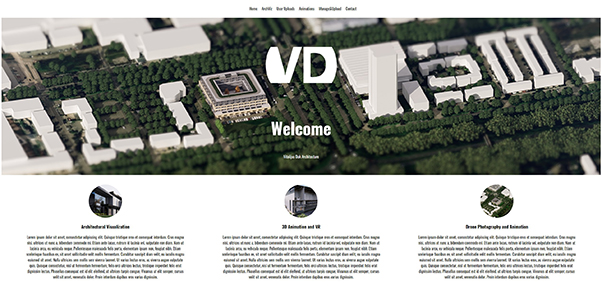
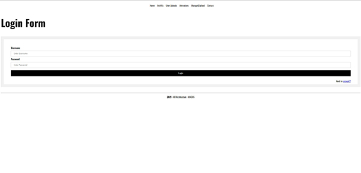
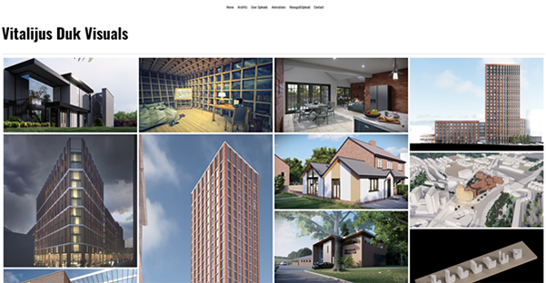

# Archweb-repo

This is an architectural portfolio website build during the Msc course

## Description

Allows users to register accounts, login and upload images onto their portfolio profiles. This website is developed without the help of Bootstrap.

## index

## login

## gallery

